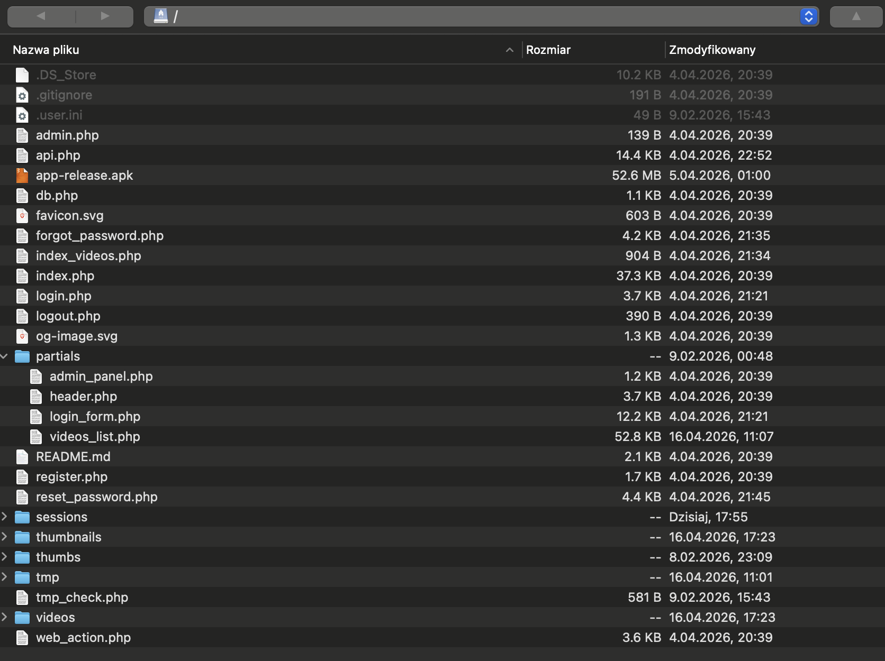

Potwierdzenie zasad pracy
# VideoWeb

Aplikacja webowa do oglądania filmów. Użytkownik może się zarejestrować, 
zalogować, przeglądać filmy, streamować je oraz lajkować. 
Komentarze dostępne tylko przez aplikację mobilną.

Drugie repo (mobilka): https://github.com/terapeutaLPG/flutterarchitektura

## Stack
- PHP (vanilla)
- MySQL
- autoryzacja tokenem (Bearer token w bazie)

## Zasady pracy z repo
- brak pushowania bezpośrednio na main, tylko PR
- każdy PR wymaga review drugiej osoby
- PR wysyłamy dzień przed zajęciami do 23:59:59 + changelog

## Endpointy API

Wszystkie requesty idą do `api.php?endpoint=...`  
Endpointy z auth wymagają nagłówka: `Authorization: Bearer {token}`

### Auth
| Metoda | Endpoint | Auth | Opis |
|--------|----------|------|------|
| POST | /api.php?endpoint=register | nie | rejestracja (email + hasło min. 6 znaków) |
| POST | /api.php?endpoint=login | nie | logowanie, zwraca token |
| POST | /api.php?endpoint=logout | tak | wylogowanie, usuwa token z bazy |

### Filmy
| Metoda | Endpoint | Auth | Opis |
|--------|----------|------|------|
| GET | /api.php?endpoint=videos | tak | lista filmów z miniaturkami i opisami |
| GET | /api.php?endpoint=stream&file={nazwa} | tak | streaming MP4, obsługa Range |

### Lajki
| Metoda | Endpoint | Auth | Opis |
|--------|----------|------|------|
| GET | /api.php?endpoint=like&file={nazwa} | tak | czy polubione + łączna liczba lajków |
| POST | /api.php?endpoint=like&file={nazwa} | tak | toggle polubienia |

### Komentarze (tylko mobilka)
| Metoda | Endpoint | Auth | Opis |
|--------|----------|------|------|
| GET | /api.php?endpoint=comments&file={nazwa} | tak | ostatnie 50 komentarzy |
| POST | /api.php?endpoint=comments&file={nazwa} | tak | dodanie komentarza (max 500 znaków) |
| DELETE | /api.php?endpoint=comments&file={nazwa} | tak | usunięcie własnego komentarza (body: {"id": X}) |

## Diagram komunikacji

```mermaid
graph TD
    A[Web - PHP] -->|REST| B[api.php]
    C[Mobile - Flutter] -->|REST| B
    B -->|PDO| D[(MySQL)]


zdjęcie z aplikacji typu WinSCP
